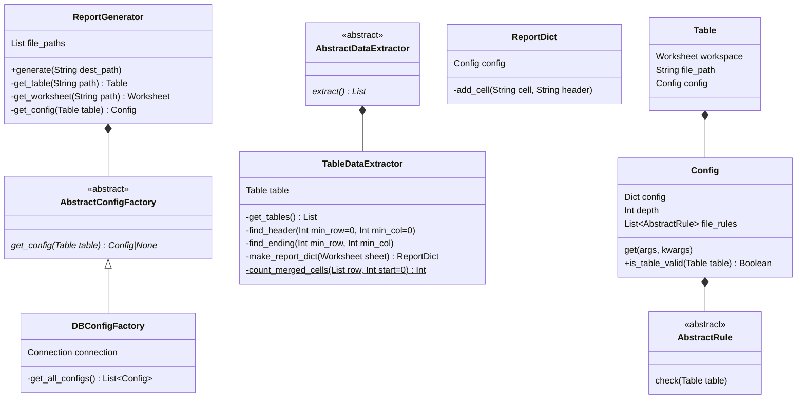
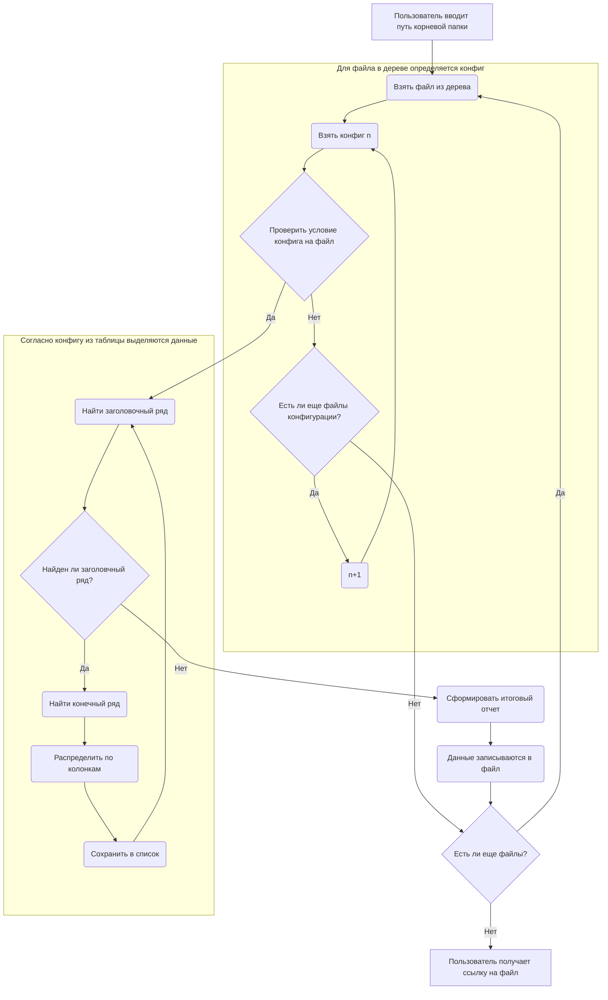

# PupsApp
Приложение для обработки данных страховых компаний

# Документация

## Диграмма классов

```mermaid
classDiagram
	AbstractConfigFactory <|-- DBConfigFactory

	class AbstractConfigFactory {
		<<abstract>>
		get_config(Table table)* Config|None
	}

	class DBConfigFactory {
		Connection connection
		-get_all_configs()List~Config~
	}

	ReportGenerator *-- AbstractConfigFactory

	class ReportGenerator {
		List<String> file_paths
		
		+generate(String dest_path)
		-get_table(String path) Table
		-get_worksheet(String path) Worksheet
		-get_config(Table table) Config
	}

	AbstractDataExtractor *-- TableDataExtractor

	class AbstractDataExtractor {
		<<abstract>>
		extract()* List<ReportDict>
	}

	class TableDataExtractor {
		Table table

		-get_tables() List<Worksheet>
		-find_header(Int min_row=0, Int min_col=0)
		-find_ending(Int min_row, Int min_col)
		-make_report_dict(Worksheet sheet) ReportDict
		-count_merged_cells(List row, Int start=0)$ Int
	}

	class ReportDict {
		Config config

		-add_cell(String cell, String header)
	}

	Config *-- AbstractRule
	Table *-- Config

	class Config {
		Dict config
		Int depth
		List~AbstractRule~ file_rules

		get(args, kwargs)
		+is_table_valid(Table table) Boolean
	}

	class Table{
		Worksheet workspace
		String file_path
		Config config
	}

	class AbstractRule {
		<<abstract>>
		check(Table table)
	}
```

## Последовательность работы

```mermaid
flowchart
	I[Пользователь вводит путь корневой папки]

	IF(Взять файл из дерева)
	IC(Взять конфиг n)
	CC{Проверить условие конфига на файл}
	increm(n+1)

	ED(Согласно конфигу из таблицы выделяются данные)
	FH(Найти заголовочный ряд)
	IH{Найден ли заголовчный ряд?}
	FE(Найти конечный ряд)
	DHL(Распределить по колонкам)

	FD(Сформировать итоговый отчет)

	WD(Данные записываются в файл)
	IsLast{Есть ли еще файлы?}
	IsLastConfig{Есть ли еще файлы конфигурации?}
	O[Пользователь получает ссылку на файл]

	increm(n+1)

	I --> IF

	subgraph DC [Для файла в дереве определяется конфиг]
		IF --> IC --> CC
			      CC -- Нет --> IsLastConfig -- Да --> increm ----> IC
	end

	IsLastConfig -- Нет --> IsLast
	CC -- Да --> FH

	subgraph ED [Согласно конфигу из таблицы выделяются данные]
		FH --> IH -- Да --> FE --> DHL --> SL(Сохранить в список) --> FH
	end

	IH -- Нет --> FD

	FD --> WD
	WD --> IsLast
	IsLast -- Да --> IF
	IsLast -- Нет --> O
```

