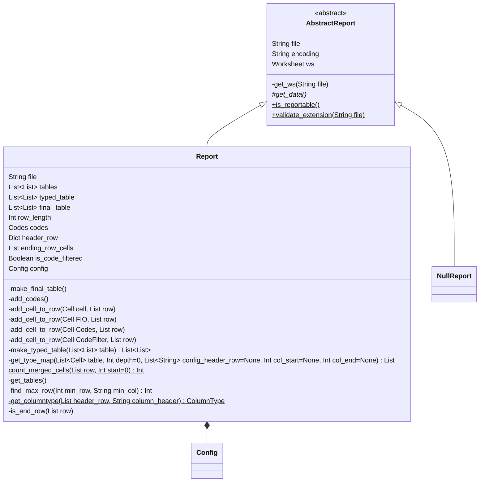

```mermaid
classDiagram
	AbstractReport <|-- Report
	AbstractReport <|-- NullReport
	Report *-- Config

	class AbstractReport {
		<<abstract>>
		String file
		String encoding
		Worksheet ws

		-get_ws(String file)
		#get_data()*
		+is_reportable()$
		+validate_extension(String file)$
	}


	class Report {
		String file
		List~List~ tables
		List~List~ typed_table
		List~List~ final_table
		Int row_length
		Codes codes
		Dict header_row
		List ending_row_cells
		Boolean is_code_filtered
		Config config

		-make_final_table()
		-add_codes()
		-add_cell_to_row(Cell cell, List row)
		-add_cell_to_row(Cell FIO, List row)
		-add_cell_to_row(Cell Codes, List row)
		-add_cell_to_row(Cell CodeFilter, List row)
		-make_typed_table(List~List~ table) List~List~
		-get_type_map(List~Cell~ table, Int depth=0, List~String~ config_header_row=None, Int col_start=None, Int col_end=None) List
		count_merged_cells(List row, Int start=0)$ Int
		-get_tables()
		-find_max_row(Int min_row, String min_col) Int
		-get_columntype(List header_row, String column_header)$ ColumnType
		-is_end_row(List row)
	}

	class NullReport
```